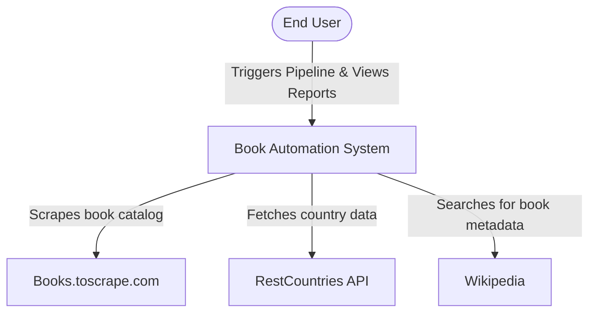
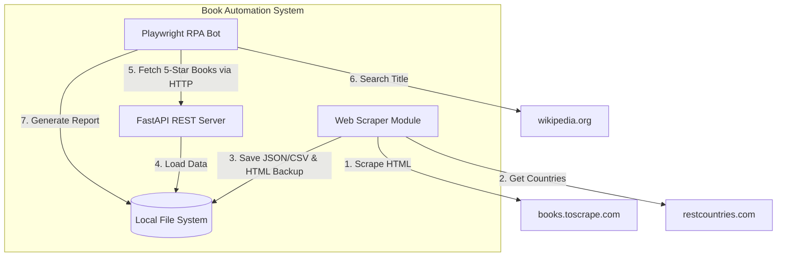
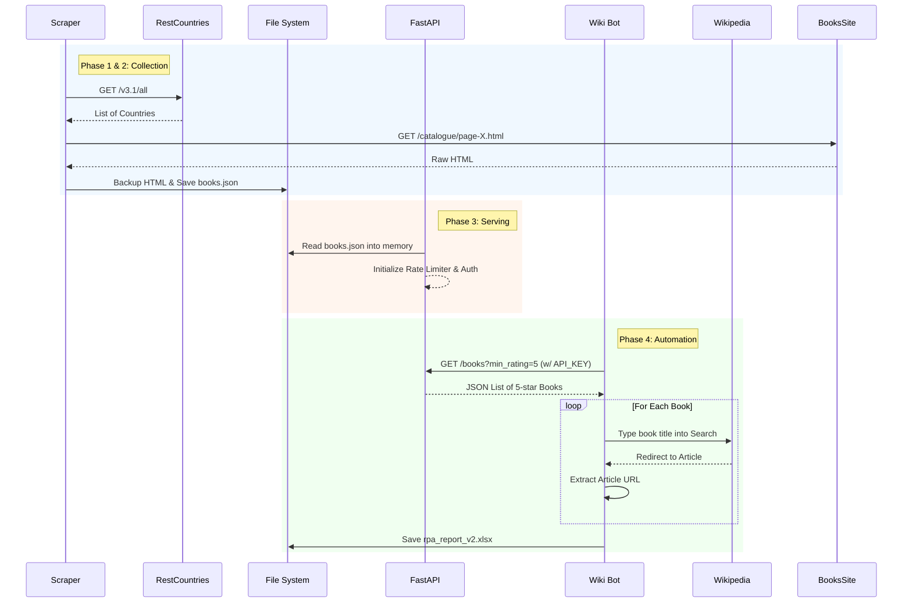

# System Architecture

This document describes the architectural design of the Book Scraper & RPA Automation System using the C4 Model approach (Context, Containers, Components) visualized via Mermaid diagrams.

## 1. System Context (Level 1)

The system context diagram shows how the system fits into the world, interacting with external web platforms to gather, enrich, and report data.

## 2. Container Diagram (Level 2)

The container diagram zooms into the `Book Automation System` to show the distinct executable units and data stores.

## 3. Data Flow & Component Execution (Level 3)

A sequence diagram showing the step-by-step lifecycle of a single book entity through the entire pipeline.

## 4. Key Design Decisions

- **Stateless API Storage**: Instead of setting up PostgreSQL or SQLite, the API reads `books.json` into memory on application startup (`lifespan` event). This removes database dependencies and keeps the setup dead-simple while remaining incredibly fast.
- **Aggressive Caching**: Wikipedia searches are potentially slow. The Playwright bot reuses a single `BrowserContext` and `Page` object instead of launching new tabs, maximizing speed and minimizing memory overhead.
- **Resilient Parsing**: The scraper doesn't crash on missing tags; it assigns default fallback values, ensuring the pipeline never breaks halfway through a 50-page scrape.
